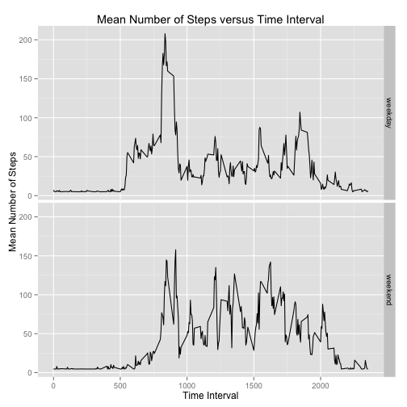

# Reproducible Research: Peer Assessment 1


## Loading and preprocessing the data

#Unzip the file

```r
if (!file.exists("activity.csv")) {
    unzip("activity.zip", overwrite = TRUE)
}
```


```r
df <- read.csv("activity.csv", colClasses = c("numeric", "character", "integer"))
# df$date <- strptime(df$date, '%Y-%m-%d')
df$date <- as.Date(df$date, "%Y-%m-%d")
```


```r
colnames(df)
```

```
## [1] "steps"    "date"     "interval"
```

```r
lapply(df, class)
```

```
## $steps
## [1] "numeric"
## 
## $date
## [1] "Date"
## 
## $interval
## [1] "integer"
```


## What is mean total number of steps taken per day?

aggregate data per day by removing the na values

```r
df1 <- aggregate(df$steps, by = list(date = df$date), FUN = sum, na.rm = TRUE)
```


Plot the histogram of number of steps taken per day

```r
hist(df1$x, breaks = 30)
```

 


Mean value of number of steps taken per day. 

```r
mean(df1$x)  #9354.23
```

```
## [1] 9354
```


Median of number of steps taken per day

```r
median(df1$x)  #10395
```

```
## [1] 10395
```


## What is the average daily activity pattern?


```r
df2 <- aggregate(df$steps, by = list(interval = df$interval), FUN = mean, na.rm = TRUE)
plot(df2$interval, df2$x, type = "l", main = "average daily pattern", xlab = "inervals", 
    ylab = "numnber of steps", xlim = c(0, 2359))
```

 


Interval when the number of steps taken was maximum

```r
df2$interval[df2$x == max(df2$x)]
```

```
## [1] 835
```

at 8:35 AM the avegare number of steps taken was maximum

## Imputing missing values

number of entried where steps data was not-known (NA)

```r
sum(is.na(df$steps))
```

```
## [1] 2304
```


Create a new dataset equal to original dataset but with missing values imputed
code adapted from [here](http://stackoverflow.com/questions/13114812/imputation-in-r)

```r
# install.packages('Hmisc')
library(Hmisc)
```

```
## Loading required package: grid
## Loading required package: lattice
## Loading required package: survival
## Loading required package: splines
## Loading required package: Formula
## 
## Attaching package: 'Hmisc'
## 
## The following objects are masked from 'package:base':
## 
##     format.pval, round.POSIXt, trunc.POSIXt, units
```

```r
df3 <- df
df3$steps <- with(df3, impute(steps, mean))
```


Plot the histogram of number of steps taken per day

```r
hist(df1$x, breaks = 30)
```

 


Mean value of number of steps taken per day. 

```r
mean(df1$x)  #9354.23
```

```
## [1] 9354
```


Median of number of steps taken per day

```r
median(df1$x)  # 10395
```

```
## [1] 10395
```


## Are there differences in activity patterns between weekdays and weekends?


```r
df3_weekend <- subset(df3, weekdays(df3$date) %in% c("Saturday", "Sunday"))
df3_weekend$day <- "weekend"
df3_weekday <- subset(df3, !weekdays(df3$date) %in% c("Saturday", "Sunday"))
df3_weekday$day <- "weekday"
df4 <- rbind(df3_weekend, df3_weekday)
```


```r
df4$day <- as.factor(df4$day)
class(df4$day)
```

```
## [1] "factor"
```


```r
df5 <- aggregate(df4$steps, by = list(interval = df4$interval, day = df4$day), 
    FUN = mean)
```


```r
library(ggplot2)
ggplot(data = df5, aes(interval, x, group = day)) + geom_line() + facet_grid(day ~ 
    .) + xlab("Time Interval") + ylab("Mean Number of Steps") + ggtitle("Mean Number of Steps versus Time Interval")
```

 


